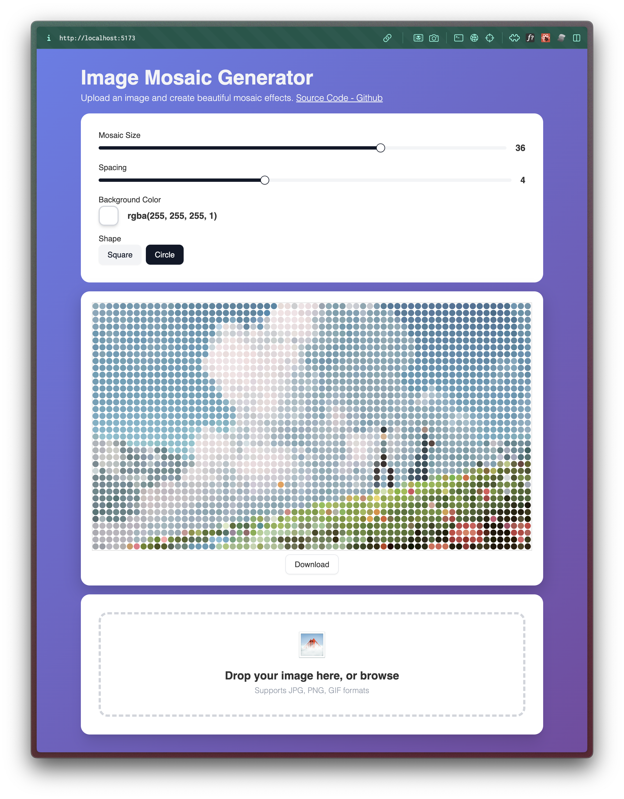

# Image Mosaic Generator

## Overview

Image Mosaic Generator is a web application that allows users to upload images and transform them into beautiful mosaic
effects. The application provides a simple, intuitive interface for uploading images and customizing the mosaic effect
with various settings.

## Inspiration

https://www.instagram.com/reel/DKUNLtVRWSF



## Features

- **Image Upload**: Easily upload images from your device
- **Customizable Mosaic Settings**:
    - Adjust tile size
    - Control spacing between tiles
    - Choose different shapes for tiles
    - Select custom colors for the mosaic effect

- **Real-time Preview**: See the mosaic effect applied to your image in real-time as you adjust settings

## Tech Stack
- **Frontend Framework**: React.js
- **Styling**: Tailwind CSS & Shadcn
- **Build Tool**: Vite 6.3.5

## How to Use
1. **Upload an Image**:
    - Click on the upload zone or drag and drop an image file
    - The application will display your image with the default mosaic effect applied

2. **Customize the Mosaic**:
    - **Size**: Adjust the size slider to change the tile size of the mosaic
    - **Spacing**: Control the gap between individual tiles
    - **Shape**: Select from available shape options (e.g., square)
    - **Color**: Choose a custom color for the mosaic effect

3. **Download or Share**:
    - After achieving your desired effect, you can save the result


## Installation

```bash
$ pnpm install # or pnpm install or yarn install
$ pnpm run dev # or pnpm install or yarn install
```


